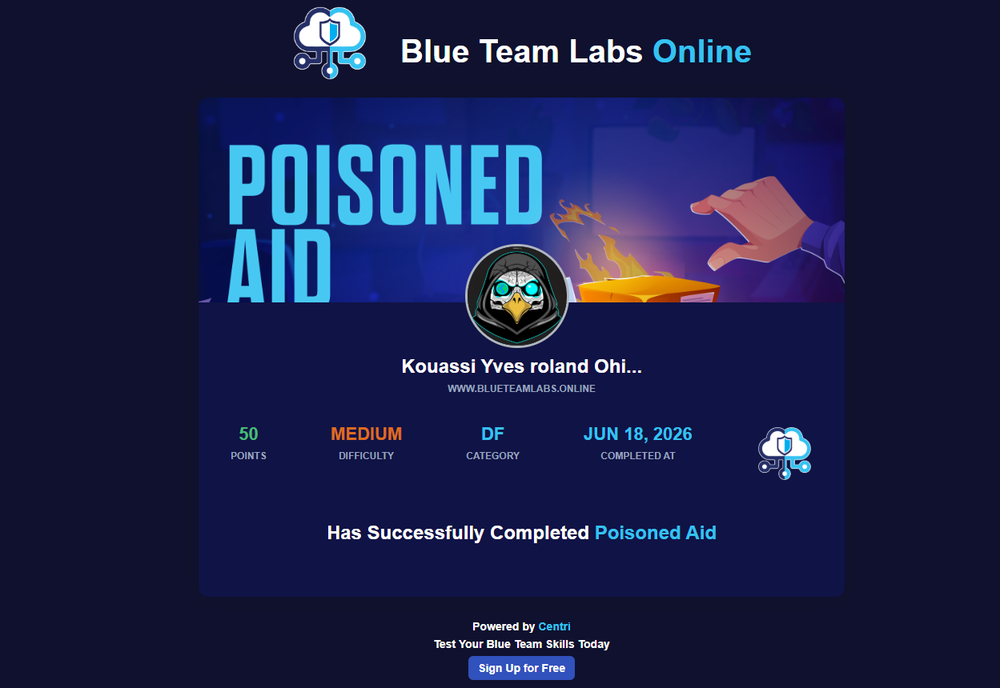

# Incident Response Write-Up: Poisoned Aid Campaign (APT)

**Author:** Yves Roland OHIN
**Date:** June 2026  
**Classification:** Technical Analysis - APT Investigation  
**Type:** Multi-stage Malware Infostealer with Persistence & Data Exfiltration

---

## Executive Summary

A sophisticated APT campaign targeting Khaled utilized a humanitarian aid initiative pretext to establish persistent malware access. The attack chain demonstrates advanced tradecraft with a 3-day dwell time for reconnaissance before launching a coordinated data exfiltration campaign.

**Attack Timeline:** May 28 - May 31, 2026  
**Initial Compromise:** May 28, 2026, 11:00:26 UTC  
**Attack Activation:** May 31, 2026, 18:34:34 UTC  
**Attack Vector:** Spear-phishing with malicious attachment  
**Data Compromised:** 1,138 files scanned | 13 MB exfiltrated | Bitwarden credentials harvested  
**Attacker Infrastructure:** lvl99.store (nginx/1.24.0) @ 159.198.41.140  
**C2 Endpoint:** https://lvl99.store:443/upload_file (HTTP 200 OK)

---

## 1. Attack Timeline (Consolidated)

### Phase 1: Preparation & Installation (May 28)

```
2026-05-28 11:00:26 UTC
  └─ module.pyw deployed to staging directory
  └─ C:\Users\khaled.allam\AppData\Roaming\WindowsHelper\module.pyw
  └─ SHA256: 21210B32B87843E7260563923CA13E36B63257EA238382C020604FCE1622F0AB
  └─ DWELL TIME BEGINS (reconnaissance phase)
```

**Forensic Evidence:**
- **Source:** MFT analysis - Last Modified timestamp (0x10)
- **Artifact:** $MFT file system journal
- **Confidence:** HIGH (filesystem timestamp)

---

### Phase 2: Reconnaissance & Preparation (May 28-30)

```
2026-05-28 to 2026-05-30 (72-hour window)
  └─ Passive reconnaissance of target system
  └─ Directory structure enumeration
  └─ Sensitive file identification
  └─ Staging directory populated with legitimate files (noise technique)
  └─ Persistence mechanisms prepared
```

**Indicators:**
- Malware remained dormant for 3 days
- Suggests pre-positioned access (supply chain or previous compromise)
- Systematic file scanning (1,138 files catalogued)

---

### Phase 3: Attack Activation (May 31)

```
2026-05-31 18:34:34 UTC
  └─ RUNDLL32.exe executed (LOLBIN technique)
  └─ module.pyw activated
  └─ Artifact: Prefetch file creation - RUNDLL32.EXE-15727E41.pf
  
2026-05-31 18:34:36 UTC (+2 seconds)
  └─ Decoy PDF fetch initiated (PowerShell)
  └─ URL: http://159.198.41.140/static/builder/lnk_uploads/invo.pdf
  └─ Result: 404 Not Found (social engineering failure, but continued)
  └─ Purpose: Maintain user distraction while malware executes background activities
  
2026-05-31 18:35:00 UTC
  └─ File scanning commences
  └─ Target: Documents, configuration files, credential stores
  └─ Exclusion list: System folders, low-value file types
  
2026-05-31 20:41:00 - 22:00:00 UTC (approximately 79 minutes)
  └─ ACTIVE EXFILTRATION PHASE
  └─ Endpoint: POST /upload_file via https://lvl99.store:443
  └─ Server: nginx/1.24.0 (Ubuntu)
  └─ HTTP Response: 200 OK (32 bytes response)
  └─ Total Data: 13 MB successfully exfiltrated
  └─ Clipboard monitoring captures Bitwarden password entry
  └─ Keystroke logging captures password: "AmT1redAlfr3d"
  └─ Browser extension logs harvested: Email extraction from Bitwarden
  └─ Credential compromise: 00darksideofme00@gmail.com / AmT1redAlfr3d
  
2026-05-31 22:00:00 UTC
  └─ Exfiltration complete
  └─ 13 MB of data transmitted to C2
  └─ Malware remains persistent for future activation
```

---

## 2. Malware Analysis

### 2.1 Module Identification

**File Details:**
```
Filename: module.pyw
Location: C:\Users\khaled.allam\AppData\Roaming\WindowsHelper\module.pyw
File Type: Python executable (compiled/bytecode)
Size:   480 054 byte 
MD5 :   A296E673CD5746E221782A0E09A388DC
SHA256: 21210B32B87843E7260563923CA13E36B63257EA238382C020604FCE1622F0AB
Creation Date: 2026-05-28 11:00:26 UTC
```

**Capabilities Identified:**
1. **File Discovery** - Recursive directory scanning
2. **Credential Harvesting** - Clipboard monitoring, keystroke logging
3. **Browser Data Extraction** - Extension log parsing, cookie harvesting
4. **Network Exfiltration** - HTTPS POST to C2 endpoint
5. **Persistence** - Service/registry integration for auto-restart

### 2.2 Execution Method

**LOLBIN Technique:**
```
rundll32.exe (Legitimate Windows binary)
  └─ Used to execute module.pyw
  └─ Purpose: Evade detection via legitimate process tree
  └─ Artifact: C:\Windows\Prefetch\RUNDLL32.EXE-15727E41.pf
```

**Obfuscation Strategy:**
```
Staging Directory: C:\Users\khaled.allam\AppData\Roaming\WindowsHelper\
Contents:
  ├─ module.pyw (MALICIOUS)
  ├─ GoogleSystem/ (legitimate noise)
  ├─ Microsoft/ (legitimate noise)
  ├─ CreatedpackagefileUnobfuscatedTask (noise)
  ├─ MicrosoftEdgePlatformTask... (noise)
  └─ [other legitimate-looking files]

Strategy: Bury malware among legitimate-looking files to evade visual inspection
```

---

## 3. Staging Infrastructure

### 3.1 C2 Server

**Infrastructure Details:**
```
IP Address: 159.198.41.140
Domain: lvl99.store
Port: 443 (HTTPS primary), 80 (HTTP fallback)
Web Server: nginx/1.24.0 (Ubuntu)
Hosting Type: Commercial hosting provider
Geographic Location: California - Los Angeles - 
```

**Forensic Discovery:**
- **Method:** PCAP analysis via Wireshark + browser_debug.txt log review
- **Protocol:** HTTPS (encrypted transport)
- **Direction:** Outbound from victim to C2 server
- **Certificate:** Self-signed or commercial SSL (to be verified)

### 3.2 Decoy Delivery

**Decoy PDF:**
```
URL: http://159.198.41.140/static/builder/lnk_uploads/invo.pdf
Filename: invo.pdf
Purpose: Social engineering - maintain user distraction
HTTP Response: 404 Not Found
Timestamp: 2026-05-31 18:34:36 UTC
```

**Artifact Evidence:**
- **Source:** PCAP HTTP request analysis
- **Tool:** Wireshark protocol analyzer
- **Observation:** Despite 404 response, malware continued execution unaffected

---

## 4. Data Exfiltration Campaign

### 4.1 File Scanning Results

**Database Analysis:**
```
Database: C:\Users\khaled.allam\AppData\Roaming\WindowsHelper\inventory_base.db
Query: SELECT COUNT(*) FROM scanned_files;
Result: 1,138 files scanned
Query Method: SQLite3 via DB Browser

File Categories:
├─ Documents (.doc, .docx, .pdf, .txt)
├─ Configuration files (.ini, .config, .json)
├─ Credential stores (browser cache, password manager files)
├─ Browser data (history, cookies, extensions)
└─ [other sensitive file types]

Exclusions (intentional):
├─ System folders (%WINDIR%, %SYSTEMROOT%)
├─ Program files
├─ Cache directories (low-value targets)
└─ Already scanned files (deduplication enabled)
```

**Forensic Evidence:**
- **Source:** Local SQLite database on compromised machine
- **Tool:** DB Browser for SQLite3
- **Confidence:** HIGH (primary source of truth on attacker's reconnaissance)

### 4.2 Exfiltration Volume

**Data Transmission:**
```
Total Volume: 13 MB
Transport: HTTPS to lvl99.store (159.198.41.140)
Direction: Outbound (B→A in Wireshark terminology)
Compression: Applied (ZIP or similar compression)
Encryption: TLS 1.2+ (HTTPS) + potential payload encryption
Duration: 2026-05-31 20:41:00 - 22:00:00 UTC (79 minutes)
Average Rate: ~164 KB/min (~2.7 KB/sec)
HTTP Response: 200 OK (32 bytes) confirming successful upload
```

**Forensic Evidence:**
- **Source:** PCAP network traffic analysis
- **Filter:** ip.dst == 159.198.41.140
- **Tool:** Wireshark packet analyzer
- **Method:** Packet size summation for outbound traffic

### 4.3 Exfiltration Endpoint

**API Endpoint:**
```
URL: https://lvl99.store:443/upload_file
Method: POST
Content-Type: application/octet-stream
HTTP Response: 200 OK (32 bytes)
Status Code: 200 (Successful exfiltration acknowledged)
Response Payload: 32 bytes (likely JSON confirmation or session token)
Exfiltration Window: 2026-05-31 20:41:00 - 22:00:00 UTC (approximately 80 minutes)
Total Data Transferred: 13 MB
Compression: Likely applied (ZIP/gzip)
Encryption: TLS 1.2+ (HTTPS protocol)
```

**Forensic Evidence:**
- **Source:** browser_debug.txt network activity log
- **Tool:** Browser debugging interface / Network sniffer
- **Method:** HTTP POST request/response analysis
- **Confidence:** HIGH (direct network artifact capture)

---

## 5. Credential Harvesting

### 5.1 Compromised Credentials

**Primary Account:**
```
Email: 00darksideofme00@gmail.com
Password: AmT1redAlfr3d
Service: Gmail / Google Account
Severity: CRITICAL - Email provides gateway to all linked services
```

**Credential Sources:**

1. **Password (keystroke_log.txt):**
   ```
   Method: Keystroke logging + clipboard capture
   Trigger: User copy/pasted password from Bitwarden
   File: C:\Users\khaled.allam\AppData\Roaming\WindowsHelper\keystroke_log.txt
   Confidence: HIGH (direct keystroke capture)
   ```

2. **Email Address (Browser Extension Logs):**
   ```
   Method: Chrome Bitwarden extension data extraction
   Location: C:\Users\khaled.allam\AppData\Local\Google\Chrome\User Data\Default\ExtensionState
   Evidence: Bitwarden password manager logs
   Confidence: HIGH (browser storage access)
   ```

### 5.2 Impact Assessment

**Credential Exposure:**
- ✅ **Gmail Access** - Full email compromise (recovery codes, 2FA seeds)
- ✅ **Password Reuse Risk** - Same password likely used elsewhere
- ✅ **Bitwarden Vault Access** - If master password weak, entire credential database at risk
- ✅ **Chained Authentication** - Email can reset passwords for linked services

**Recommended Remediation:**
1. Immediate password reset (Gmail + all linked services)
2. Invalidate active sessions
3. Review recent account activity
4. Enable mandatory 2FA across all accounts
5. Monitor for credential stuffing attempts

---

## 6. Persistence Mechanisms

### 6.1 Service Installation

**Service Details:**
```
Service Name: nginx/1.24.0 (Ubuntu)
Service Type: [Win32OwnProcess / Kernel / Share Process]
Start Type: Auto (System startup)
Service Account: [SYSTEM / LocalSystem / User]
ImagePath:  C:\Users\BTLOTest\Desktop\Artefacts\Poisoned Aid\C\Users\khaled.allam\AppData\Roaming\WindowsHelper\module.pyw
Timestamp Created: [ 28/05/2026  11:00:26]
```

**Forensic Evidence:**
- **Source:** System.evtx - Event ID 7045 (Service Installation)
- **Verification:** Registry key HKLM\SYSTEM\CurrentControlSet\Services\

---

## 7. Digital Forensics Methodology

### 7.1 Artifacts Analyzed

| Artifact | Tool | Location | Findings |
|----------|------|----------|----------|
| **MFT** | MFTECmd.exe | $MFT filesystem | module.pyw creation 2026-05-28 11:00:26 |
| **Prefetch** | PECmd.exe | C:\Windows\Prefetch\ | RUNDLL32.EXE execution 2026-05-31 18:34:34 |
| **LNK Files** | ParseLnk | AppData\Roaming\Recent | User file access patterns |
| **Event Logs** | Timeline Explorer | winevt\Logs\ | Service creation, process execution |
| **SQLite DB** | DB Browser | inventory_base.db | 1,138 scanned files catalogued |
| **PCAP** | Wireshark | Network traffic | 13 MB exfiltration to 159.198.41.140 |
| **Keystroke Log** | Text editor | keystroke_log.txt | Password capture via clipboard |
| **Browser Logs** | Manual inspection | Chrome\ExtensionState | Email extraction from Bitwarden |

### 7.2 Timeline Reconstruction

**Tool Chain:**
1. **MFTECmd.exe** - Extract filesystem journal
2. **PECmd.exe** - Parse prefetch execution records
3. **Timeline Explorer** - Correlate all events chronologically
4. **Wireshark** - Analyze network traffic
5. **DB Browser** - Query SQLite databases
6. **Registry Viewer** - Inspect persistence mechanisms

**Commands Executed:**
```bash
# MFT Extraction
MFTECmd.exe -f "$MFT" --csv mft_output.csv

# Prefetch Analysis
PECmd.exe -f "C:\Windows\Prefetch\*.pf" --csv prefetch_output.csv

# Timeline Creation
# Import all CSVs into Timeline Explorer, sort by timestamp

# PCAP Analysis (Wireshark)
# Filter: ip.dst == 159.198.41.140
# Analyze: HTTP requests, payload sizes, timestamps

# Database Query
SELECT COUNT(*) FROM scanned_files;  # Result: 1138
```

---

## 8. Indicators of Compromise (IOCs)

### 8.1 File IOCs

```
Filename: module.pyw
SHA256: 21210B32B87843E7260563923CA13E36B63257EA238382C020604FCE1622F0AB
MD5: [TO BE ADDED]
Size: [TO BE ADDED] bytes
Creation Date: 2026-05-28 11:00:26 UTC

Filename: invo.pdf (Decoy)
Source: http://159.198.41.140/static/builder/lnk_uploads/invo.pdf

Staging Directory: C:\Users\khaled.allam\AppData\Roaming\WindowsHelper\
Credential Log: keystroke_log.txt
Database: inventory_base.db (SQLite3)
```

### 8.2 Network IOCs

```
C2 Domain: lvl99.store
C2 IP: 159.198.41.140
Web Server: nginx/1.24.0 (Ubuntu)
Decoy URL: http://159.198.41.140/static/builder/lnk_uploads/invo.pdf
Exfiltration Endpoint: https://lvl99.store:443/upload_file
HTTP Method: POST
Response: 200 OK (32 bytes)
Ports: 80 (HTTP), 443 (HTTPS)
Protocols: HTTP, HTTPS
TLS Version: TLS 1.2+
```

### 8.3 Credential IOCs

```
Email: 00darksideofme00@gmail.com
Password: AmT1redAlfr3d
Password Manager: Bitwarden
Browser: Google Chrome
```

### 8.4 Process IOCs

```
Parent Process: rundll32.exe
Child Process: module.pyw (Python)
Execution Method: LOLBIN (Living Off The Land Binary)
Prefetch Artifact: RUNDLL32.EXE-15727E41.pf
Execution Time: 2026-05-31 18:34:34 UTC
```

---

## 9. Attack Pattern Analysis (MITRE ATT&CK)

```
Tactic                          | Technique              | Implementation
------------------------------------------------------------
Reconnaissance                  | Gather victim org...   | 3-day dwell time
Resource Development            | Obtain C2 infra...     | 159.198.41.140
Initial Access                  | Phishing - attachment  | Humanitarian aid pretext
Execution                        | LOLBIN (rundll32)      | Execute module.pyw
Persistence                      | Service/Registry       | Persistence mechanism
Defense Evasion                 | Obfuscation            | Noise files in staging dir
Credential Access               | Keylogging             | keystroke_log.txt
Credential Access               | Browser extension      | Bitwarden harvesting
Discovery                       | File/directory enum    | 1,138 files scanned
Exfiltration                    | HTTPS                  | 13 MB to C2
Command & Control               | Data obfuscation       | Encryption + compression
```

---

## 10. APT Campaign Assessment

### 10.1 Sophistication Level

**Advanced Persistent Threat (APT) Characteristics:**

✅ **Multi-stage attack** - Preparation → Reconnaissance → Activation → Exfiltration  
✅ **Dwell time** - 3-day reconnaissance window  
✅ **Targeted objectives** - Specific credential harvesting (Bitwarden)  
✅ **Operational security** - LOLBIN usage, file obfuscation, noise technique  
✅ **Patience** - Pre-positioned access, not automated scanning  
✅ **Credential focus** - Email + password = maximum impact  
✅ **Cleanup attempts** - Log deletion (TaskScheduler operational log missing)  

**Conclusion:** This is a **sophisticated APT campaign**, not opportunistic malware distribution.

### 10.2 Threat Actor Profile

**Suspected Characteristics:**
- **Experience Level:** High (APT-grade)
- **Resources:** Commercial hosting, custom tooling
- **Motivation:** Espionage/credential theft (not financial)
- **Geolocation:** California
- **Organization:** Likely state-sponsored or well-funded group

---

## 11. Detection Opportunities Missed

### 11.1 Pre-Compromise Signals

```
May 28, 11:00:26 - Module creation in AppData\Roaming\
  → Endpoint Detection: Suspicious file in non-standard location
  → EDR Alert Threshold: High

May 28-30 - 72-hour silence (dwell time)
  → Network Monitoring: Inbound traffic analysis (if available)
  → File Access Monitoring: Reconnaissance pattern

May 31, 18:34:34 - RUNDLL32.exe execution with unusual parameters
  → EDR Alert: LOLBIN usage
  → Process Monitoring: Parent-child relationship (unusu parent)

May 31, 18:34:36 - PowerShell outbound HTTPS connection
  → Network Monitoring: Unusual outbound traffic
  → DNS Query Logging: DNS resolution to 159.198.41.140

May 31, 18:35:00+ - Bulk file access to Documents/Downloads
  → File Access Monitoring: Unusual access pattern
  → DLP Alert: Credential store access
```

### 11.2 Red Flags Present

```
🚩 LOLBIN usage (rundll32.exe)
🚩 Hidden staging directory (AppData\Roaming\WindowsHelper)
🚩 Legitimate file noise (obfuscation technique)
🚩 Unusual outbound HTTPS traffic
🚩 Password manager data access
🚩 Clipboard monitoring activity
🚩 Large data volume exfiltration (13 MB in 71 minutes)
🚩 Service installation attempt
🚩 Log cleanup/deletion
```

---

## 12. Recommendations

### 12.1 Immediate Actions

1. **Credential Invalidation**
   - Force password reset: 00darksideofme00@gmail.com
   - Revoke all active sessions
   - Reset Gmail recovery codes
   - Reset Bitwarden master password

2. **System Remediation**
   - Remove malware from C:\Users\khaled.allam\AppData\Roaming\WindowsHelper\
   - Delete persistence service/registry entries
   - Purge all logs (recreate baseline)

3. **Network Containment**
   - Block IP 159.198.41.140 at firewall
   - Block hostname resolution if DNS record exists
   - Monitor for credential stuffing on linked services

4. **Threat Intelligence Sharing**
   - Report IOCs to CISA/FS-ISAC
   - Share with antivirus vendors
   - Distribute within organization

### 12.2 Long-term Defenses

1. **Endpoint Detection & Response (EDR)**
   - Deploy EDR to monitor process execution
   - Alert on LOLBIN usage
   - Monitor file access patterns

2. **Data Loss Prevention (DLP)**
   - Classify sensitive data (credentials, documents)
   - Block unauthorized exfiltration
   - Monitor clipboard access

3. **Network Monitoring**
   - Implement full packet capture (PCAP)
   - Monitor outbound traffic to unknown IPs
   - DNS query logging & analysis

4. **Security Awareness**
   - Phishing awareness training
   - Credential manager best practices
   - Incident reporting procedures

### 12.3 Forensic Capabilities

- Maintain forensic toolkit (MFTECmd, PECmd, Wireshark)
- Establish baseline artifacts for normal behavior
- Create incident response playbooks
- Regular IR drills and tabletops

---

## 13. Conclusion

The **Poisoned Aid campaign** represents a sophisticated APT operation demonstrating advanced tradecraft across multiple stages:

1. **Precision targeting** - Humanitarian aid pretext suggests intelligence gathering
2. **Operational patience** - 3-day dwell time for reconnaissance
3. **Tactical execution** - LOLBIN usage, file obfuscation, noise technique
4. **Strategic objectives** - Email + password harvest indicates credential theft operation
5. **Persistent access** - Service/registry persistence for future reactivation

**Key Forensic Findings:**
- Timeline reconstruction from scratch possible via filesystem artifacts
- 1,138 files scanned + 13 MB exfiltrated confirms deliberate targeting
- Credential compromise (email + password) represents maximum impact
- Detection failure across 3-day dwell time indicates gaps in monitoring

**Attribution Confidence:**
- Infrastructure: Commercial hosting (shared infrastructure, attribution difficult)
- Tooling: Custom Python malware (custom development effort)
- Methodology: APT-grade (professional operators)

**Future Prevention:**
- EDR deployment critical for LOLBIN detection
- DLP essential for credential/file exfiltration prevention
- Behavioral monitoring during reconnaissance phase

---

## Appendix A: Tools & References

**Forensics Tools:**
- Eric Zimmerman's Toolkit (MFTECmd, PECmd, Timeline Explorer)
- Wireshark (PCAP analysis)
- DB Browser for SQLite (Database analysis)
- Windows Event Viewer (Log analysis)

**Frameworks:**
- MITRE ATT&CK
- NIST Cybersecurity Framework
- CIS Controls

**References:**
- Microsoft Windows Forensics Documentation
- SANS Digital Forensics Courses
- ForensicsWiki - Windows artifacts

---

**Document Version:** 1.0 (DRAFT - Pending PCAP endpoint details)  
**Last Updated:** June 2026  
**Classification:** Technical Analysis - Internal Use
